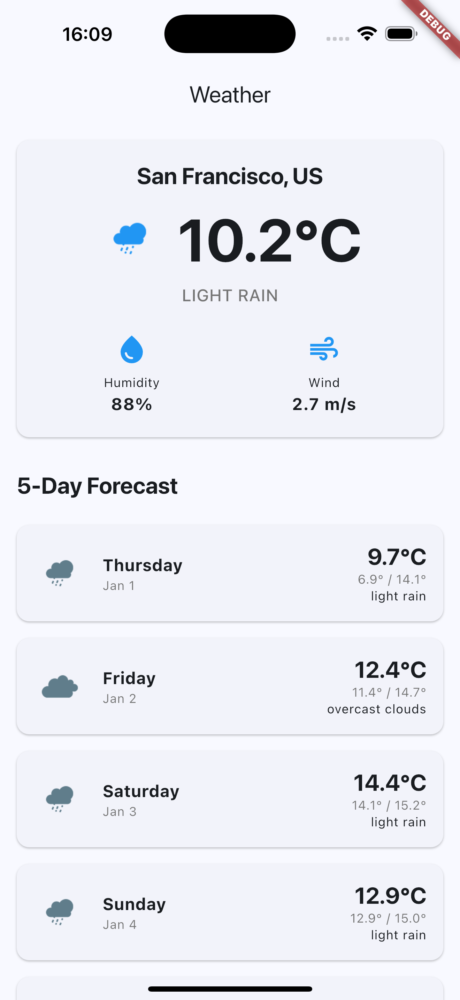

# Weather App

A Flutter application that displays current weather and 5-day forecast for the user's current location. Built with Clean Architecture principles, featuring offline caching, responsive UI, and comprehensive error handling.

## Features

- 🌤️ **Current Weather Display**: Temperature, humidity, wind speed, weather icon, and location
- 📅 **5-Day Forecast**: Daily temperature, min/max temps, weather conditions, and icons
- 📍 **Automatic Location Detection**: Fetches weather based on device location
- 🔄 **Pull-to-Refresh**: Refresh weather data by pulling down
- 💾 **Offline Caching**: Hive-based caching for offline access with 1-hour expiration
- 🔌 **Offline Indicator**: Visual banner when showing cached data
- 📱 **Responsive Design**: Adapts to both portrait and landscape orientations
- ⚠️ **Error Handling**: Graceful error handling with retry functionality
- 🧪 **Comprehensive Testing**: Unit tests for use cases, repositories, and cubit

## Screenshots

## Architecture

This project follows **Clean Architecture** principles, organized into three main layers:

### Layer Structure
lib/src/
├── core/ # Core utilities and services
│ ├── cache/ # Hive cache setup
│ ├── di/ # Dependency injection (GetIt)
│ ├── services/ # Location service
│ └── utils/ # Result type, error mappers
│
├── domain/ # Business logic layer (no external dependencies)
│ ├── entities/ # Weather, Forecast, Location entities
│ ├── repositories/ # Repository interfaces
│ └── usecases/ # GetCurrentWeather, GetForecast
│
├── data/ # Data layer
│ ├── datasources/ # Remote (API) and Local (Hive cache)
│ ├── models/ # DTOs with JSON parsing
│ └── repositories/ # Repository implementations
│
└── presentation/ # UI layer
├── cubit/ # WeatherCubit and WeatherState
├── screens/ # WeatherScreen
└── widgets/ # Reusable UI components

### Architecture Principles

1. **Dependency Rule**: Dependencies flow inward (Presentation → Domain ← Data)
   - Domain layer has no dependencies on other layers
   - Presentation depends on Domain
   - Data depends on Domain

2. **Separation of Concerns**:
   - **Presentation**: UI, state management (Cubit), widgets
   - **Domain**: Business logic, entities, use cases
   - **Data**: API calls, caching, data models

3. **Dependency Injection**: All dependencies injected via GetIt
   - Controllers/Cubits don't create their own dependencies
   - All registered as lazy singletons or factories

4. **Testability**: Clean interfaces allow easy mocking and testing

## Dependencies

### Core Dependencies

- **flutter_bloc** (^9.1.1): State management with Cubit
- **dio** (^5.9.0): HTTP client for API requests
- **get_it** (^9.2.0): Dependency injection
- **hive_flutter** (^1.1.0): Local database for caching
- **geolocator** (^14.0.2): Location services
- **connectivity_plus** (^7.0.0): Network connectivity status
- **intl** (^0.20.2): Date/time formatting

### Development Dependencies

- **flutter_test**: Built-in testing framework
- **flutter_lints** (^5.0.0): Linting rules

## Prerequisites

- Flutter SDK >= 3.7.2
- Dart SDK (comes with Flutter)
- Android Studio / VS Code with Flutter extensions
- OpenWeatherMap API key ([Get one here](https://openweathermap.org/api))

## Setup & Installation

### 1. Clone the Repository

git clone https://github.com/hemantchauhan/weatherapp.git
cd weatherapp

### 2. Install Dependencies
sh
flutter pub get

### 3. Configure API Key

The API key is currently configured in `lib/src/core/di/di_container.dart`. 

**Option 1: Direct Configuration (Current)**
- Open `lib/src/core/di/di_container.dart`
- Replace the `apiKey` constant with your OpenWeatherMap API key:
  const String apiKey = 'YOUR_API_KEY_HERE';
  **Option 2: Environment Variables (Recommended for production)**
- Use `--dart-define` when running:
  
  flutter run --dart-define=WEATHER_API_KEY=your_api_key_here
  - Update `di_container.dart` to read from environment variables

### 4. Platform-Specific Setup

#### Android
- Location permissions are already configured in `AndroidManifest.xml`
- No additional setup required

#### iOS
- Location permissions are configured in `Info.plist`
- Run `pod install` in the `ios` directory:
  cd ios
  pod install
  cd ..
  
## How to Run

### Run on Connected Device/Emulator

## Run on default device
flutter run

## Run on specific device
flutter devices  

## List available devices
flutter run -d <device-id>

## Run in release mode
flutter run --release### Build for Production

## Android
flutter build apk --release
or
flutter build appbundle --release

## iOS
flutter build ios --release

## Running Tests

### Run All Tests

flutter test

### Run Specific Test Files

## Run use case tests
flutter test test/domain/usecases/

## Run repository tests
flutter test test/data/repositories/

## Run all tests with coverage
flutter test --coverage### Test Structure

- **Unit Tests**: 
  - Use case tests (`test/domain/usecases/`)
  - Repository tests (`test/data/repositories/`)
- **Test Helpers**: Mock classes in `test/` directory
- **Test Data**: Helper classes for creating test entities and JSON

## Project Structure Details

### Domain Layer
- **Entities**: Pure Dart classes representing business objects
  - `Weather`, `Forecast`, `Location`, `DailyForecast`
- **Use Cases**: Single responsibility business logic
  - `GetCurrentWeather`: Fetches current weather data
  - `GetForecast`: Fetches 5-day forecast
- **Repositories**: Abstract interfaces defining data contracts

### Data Layer
- **Remote Data Source**: HTTP API calls using Dio
- **Local Data Source**: Hive-based caching with 1-hour expiration
- **Repository Implementation**: Coordinates between remote and local sources
- **Models**: JSON parsing and entity conversion

### Presentation Layer
- **Cubit**: `WeatherCubit` manages app state
- **States**: `WeatherLoading`, `WeatherLoaded`, `WeatherError`
- **Screens**: Main weather display screen
- **Widgets**: Reusable UI components

## Key Features Implementation

### Offline Caching
- Uses Hive for local storage
- Cache expiration: 1 hour
- Cache-first strategy: Shows cached data if available, then fetches fresh data
- Offline indicator banner when showing cached data

### Error Handling
- Network errors handled gracefully
- Location permission errors with user-friendly messages
- API errors with retry functionality
- Error messages displayed in UI

### State Management
- Cubit for state management
- States: Loading, Loaded (with/without cache), Error
- Automatic state transitions

## API Integration

### OpenWeatherMap API

- **Current Weather Endpoint**: `/weather`
- **5-Day Forecast Endpoint**: `/forecast`
- **Base URL**: `https://api.openweathermap.org/data/2.5`
- **Units**: Metric (Celsius)

## Troubleshooting

### Location Not Working
- Ensure location permissions are granted
- For iOS: Check Info.plist has location usage descriptions
- For Android: Check AndroidManifest.xml has location permissions

### API Errors
- Verify API key is correct
- Check API key has proper permissions in OpenWeatherMap dashboard
- Ensure internet connection is available

### Cache Issues
- Cache is stored in device storage
- To clear cache: Uninstall and reinstall the app
- Cache expiration is 1 hour

## Future Improvements

- [ ] Dark/Light theme toggle
- [ ] Background refresh for cached data
- [ ] Weather icon animations
- [ ] Widget tests for UI components
- [ ] API key management via environment variables
- [ ] Multiple location support

## License

This project is created as a Flutter developer assignment.

## Author

Hemant Chauhan

---

**Note**: Remember to add your OpenWeatherMap API key before running the app. The API key is required for the app to fetch weather data.
